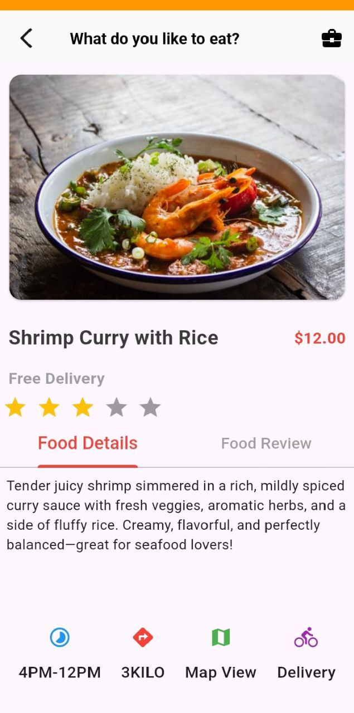

<<<<<<< HEAD
# food_delivery

A new Flutter project.

## Getting Started

This project is a starting point for a Flutter application.

A few resources to get you started if this is your first Flutter project:

- [Lab: Write your first Flutter app](https://docs.flutter.dev/get-started/codelab)
- [Cookbook: Useful Flutter samples](https://docs.flutter.dev/cookbook)

For help getting started with Flutter development, view the
[online documentation](https://docs.flutter.dev/), which offers tutorials,
samples, guidance on mobile development, and a full API reference.
=======
### App Features in Action

**Explore & Browse**  
Users are welcomed with an engaging home interface:  
- Quick-tap category icons for popular choices (burgers, pizza, drinks, cakes, ice cream)  
- Personalized "Popular Foods" carousel with heart-favorite options like Breakfast Meal and Hearty Pasta  
- Eye-catching "Best Foods" hero section featuring premium dishes (e.g., rich seafood curry with rice and fresh herbs)

**Cart & Order Summary**  
Seamless shopping cart experience:  
- Real-time item list with thumbnail previews, quantity adjusters (+/-), and remove option  
- Clear price breakdown per item and total  
- Promo code field for discounts  
- Multiple payment methods (Credit/Debit Card highlighted)  
- Prominent red "Order Now" CTA for quick checkout

>>>>>>> 588e4ef543a5187fa14a6ffdc232dc86e1aa0697
